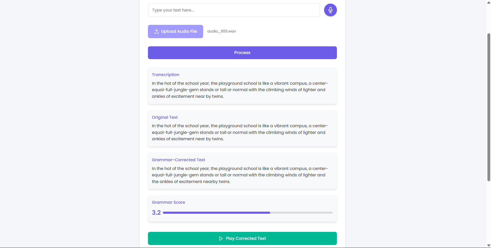
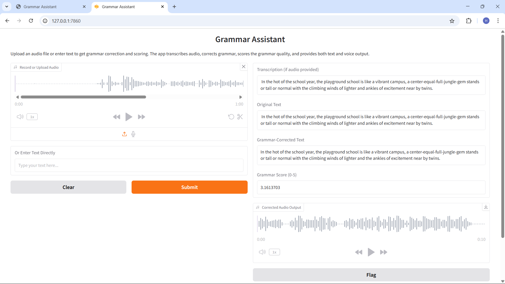

# Grammar Assistant

A comprehensive grammar correction and scoring application that processes both text and audio input to provide grammar corrections, scoring, and text-to-speech output.

## Features

- **Text Input**: Enter text directly for grammar correction and scoring
- **Audio Input**: 
  - Record audio using your microphone
  - Upload audio files (WAV, MP3, M4A, and other common formats)
- **Grammar Correction**: 
  - Uses multiple models for comprehensive grammar correction
  - Handles long texts by processing them in chunks
  - Combines results from different models for better accuracy
- **Grammar Scoring**: Evaluates the grammar quality of your text
- **Text-to-Speech**: Converts corrected text to audio
- **History**: Saves your previous corrections for reference

## Example Outputs

### Flask Web Interface

The Flask web interface provides a modern, user-friendly experience with:
- Clean audio recording interface
- Clear display of transcription, original text, and corrections
- Visual grammar score indicator
- Audio playback controls for corrected text

### Gradio Interface

The Gradio interface offers an alternative interface with:
- Simple audio recording and upload options
- Side-by-side display of original and corrected text
- Numerical grammar score display
- Downloadable corrected audio output

## Usage Examples

### Example 1: Audio Input
Input: Audio recording of the text:
"In the hot of the school year, the playground school is like a vibrant campus, a center-equal-full-jungle-gem stands or tall or normal with the climbing winds of lighter and ankles of excitement near by twins."

Output:
- **Transcription**: Accurate conversion of speech to text
- **Grammar Correction**: "In the hot of the school year, the playground school is like a vibrant campus, a center-equal-full-jungle-gem stands or tall or normal with the climbing winds of lighter and the ankles of excitement nearby twins."
- **Grammar Score**: 3.2/5.0
- **Audio Output**: Corrected text converted to speech

### Example 2: Text Input
Input: Text entry with grammar errors
Output:
- Original text preserved for comparison
- Grammar errors identified and corrected
- Grammar score calculated
- Option to hear corrected text via text-to-speech

## Installation

### Prerequisites

- Python 3.8 or higher
- pip (Python package manager)

### Setup

1. Clone the repository:
   ```
   git clone https://github.com/yourusername/grammar-assistant.git
   cd grammar-assistant
   ```

2. Install dependencies:
   ```
   pip install -r requirements.txt
   ```

3. Run the application:

   **Windows**:
   ```
   run.bat
   ```

   **Linux/Mac**:
   ```
   chmod +x run.sh
   ./run.sh
   ```

   **Manual Setup**:
   ```
   python app.py
   ```

4. Access the application at http://localhost:8080

## Usage

1. **Text Input**:
   - Enter your text in the text area
   - Click "Process Text" to get grammar correction and scoring

2. **Audio Input**:
   - Click the microphone button to record audio
   - Or click "Upload Audio" to select an audio file
   - The audio will be automatically transcribed and processed

3. **View Results**:
   - The original text and transcription (if audio) will be displayed
   - The grammar-corrected text will be shown
   - A grammar score (0-5) will be provided
   - Click the play button to hear the corrected text

## Project Structure

### Main Application Files
- `app.py` - Main Flask application file containing the server logic and API endpoints
- `templates/index.html` - Main web interface template
- `grammar_assistant.py` - Core grammar correction functionality
- `correct_output.py` - Output processing and formatting

### Model Files and Training
- `train_model.py` - Script for training the grammar scoring model
- `feature_tranning.py` - Feature extraction for model training
- `generate_embeddings.py` - Generates text embeddings for the model
- `extract_features.py` - Extracts features from audio and text
- `transcribe.py` - Handles audio transcription
- `sample_tranning.ipynb` and `tranning_model.ipynb` - Jupyter notebooks for model development

### Model Output Files (in `/outputs`)
- `grammar_scorer.pkl` - Trained grammar scoring model
- `hybrid_model.pkl` - Combined audio-text model
- Various CSV files containing training data and results

### Setup and Configuration
- `requirements.txt` - Python package dependencies
- `run.bat` and `run.sh` - Scripts to run the application on Windows and Unix systems
- `check_model.py` - Validates model existence and creates dummy model if needed
- `test_server.py` - Server testing utilities

### Documentation
- `README.md` - Project documentation and setup instructions
- `TROUBLESHOOTING.md` - Troubleshooting guide for common issues

### Directories
- `/templates` - Contains web interface templates
- `/uploads` - Temporary storage for uploaded audio files
- `/outputs` - Stores model files and training results
- `/dataset` - Contains training data
- `/models` - Stores pre-trained models
- `/offload_folder` - Used for model memory optimization

## Technical Details

### Memory Management
- Automatic memory cleanup for GPU operations
- Fallback to CPU when GPU memory is insufficient
- 4-bit quantization for models to reduce memory usage

### Error Handling
- Comprehensive error handling throughout the application
- Graceful fallbacks when operations fail
- Detailed error logging for debugging

### Text Processing
- Chunking mechanism for handling long texts
- Sentence-based processing for better grammar correction
- Multiple model approach for improved accuracy

## Troubleshooting

If you encounter any issues, please refer to the `TROUBLESHOOTING.md` file for common solutions. For connection issues, try:

1. Ensure the Flask server is running
2. Check if port 8080 is available
3. Run `python test_server.py` to diagnose connection issues
4. Check your firewall settings

## License

This project is licensed under the MIT License - see the LICENSE file for details.

## Acknowledgments

- Whisper for audio transcription
- Hugging Face for grammar correction models
- LanguageTool for additional grammar checking 
